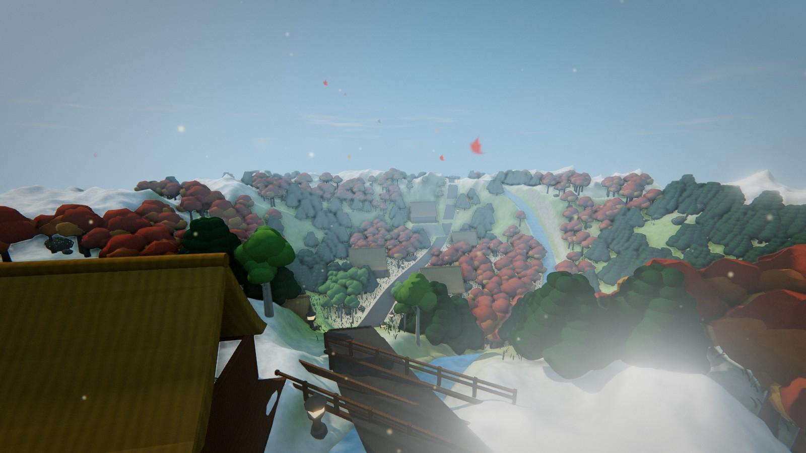
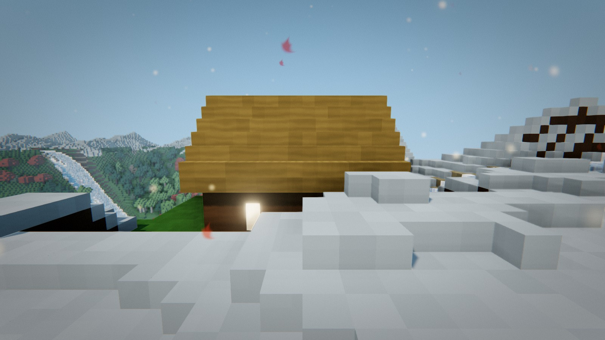
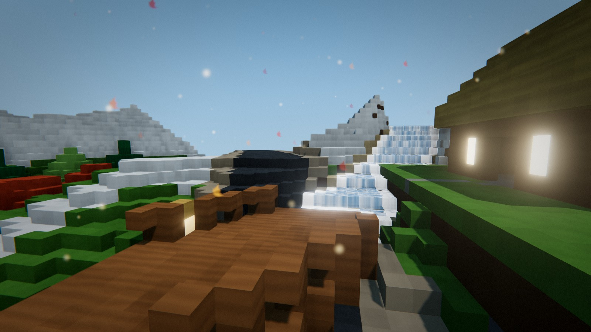
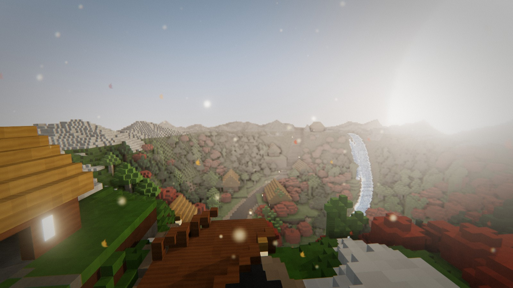
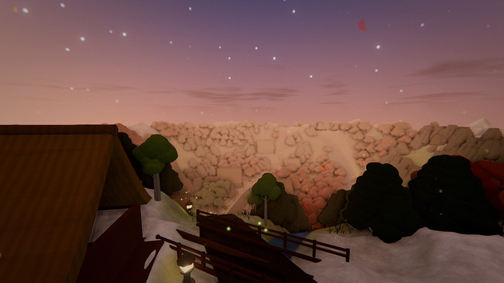
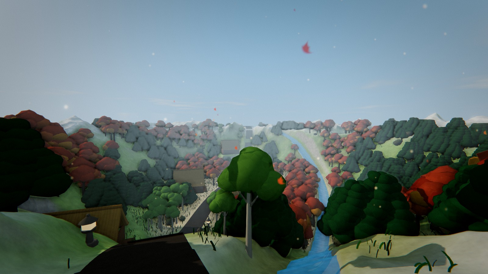

# Roads to Shirakawa-Go

[](./LICENSE)


> A high-fidelity **voxel** journey along the scenic mountain road from **Takayama to Shirakawa-go** —
> hand-built blocky gassho-zukuri farmhouses, wind-swept voxel forests and a
> shader-driven atmosphere in the spirit of the great Minecraft shader packs.



---

## Highlights

- **True voxel world, highly detailed** — a 288 × 288 × 80 block valley rendered with
  merged-face chunk meshes, per-vertex ambient occlusion, directional face shading and
  triplanar micro-texture per block: terraced rice paddies, flower-drift meadows, grass
  tufts, reeds and lily pads, moss carpets, bamboo groves, birch/maple/pine forests,
  gassho farmhouses with glowing shoji, plank bridges, cobble paths and stone lanterns.
- **Shader-pack atmosphere (SEUS/BSL spirit, voxel-native)** — volumetric god rays and
  lens flare from the sun, UnrealBloom on lanterns and water glints, ACES tone mapping,
  SMAA, SSAO plus baked voxel AO, filmic colour grade and drifting mountain mist.
- **Wind and water** — foliage, crops and grass tufts sway in a gusting wind field; voxel
  water carries waves, fresnel sky reflection, sun sparkle and foam where it meets banks.
- **Living day / night cycle** — a four-minute solar arc drives sun direction, cloud-lit
  sky dome, fog colour and lantern glow, from golden sunset to misty blue twilight
  (`N` toggles Auto / Day / Night).
- **Explore and build** — walk, sprint, jump and swim the valley; break and place blocks
  (grass, timber, thatch, stone, pine, maple, road, water) with the voxel build tool.
- **Procedural audio** — wind and mountain-stream beds, positional river and crackling
  lantern fires, plus surface-aware footsteps on grass, gravel, stone and snow.

| Gassho farmhouse | River crossing | Golden hour |
| --- | --- | --- |
|  |  |  |

| Nightfall | On the trail |
| --- | --- |
|  |  |

---

## Quickstart

Requirements: **Node.js ≥ 20.19** and npm.

```bash
# install dependencies
npm install

# start the Vite dev server (http://localhost:5173)
npm run dev

# production build → dist/
npm run build

# serve the production build locally
npm run preview
```

Click the canvas to capture the mouse and start exploring.

---

## Controls

| Input | Action |
| --- | --- |
| `W` `A` `S` `D` / Arrow keys | Move |
| Mouse | Look around |
| `Space` | Jump / swim up |
| `Shift` | Sprint |
| Left click | Dig terrain / remove placed block |
| Right click | Place selected block |
| `1`–`6` / Mouse wheel | Select building material |
| `N` | Cycle day / night mode (Auto → Day → Night) |
| `M` | Mute / unmute ambient audio |
| `G` | Cycle graphics quality (High → Medium → Low) |
| `H` | Toggle the controls panel |
| `Esc` | Release the mouse |

---

## Rendering & Atmosphere

A cinematic `EffectComposer` pipeline over the whole scene:

| Stage | Pass | Purpose |
| --- | --- | --- |
| 1 | `RenderPass` | Linear HDR render (half-float targets) |
| 2 | `SSAOPass` | Screen-space ambient occlusion in crevices |
| 3 | `UnrealBloomPass` | Glow on lanterns, windows, sun and water |
| 4 | `GodRaysPass` | Radial light shafts from the sun, with lens-flare ghosts in the grade |
| 5 | `OutputPass` | ACES filmic tone mapping + sRGB encode |
| 6 | `SMAAPass` | Subpixel anti-aliasing on silhouettes |
| 7 | `ColorGradePass` | Vignette, grain, chromatic aberration, warmth, flare ghosts |

- **Splat terrain shading** — grass, dry meadow, dirt, sand, rock and snow blended by
  slope, altitude and multi-octave noise, with triplanar micro-detail so nothing stretches.
- **Wind-sway shader** — every tree, bamboo stalk and grass blade bends with a shared
  gust field (flex-weighted vertex motion).
- **Animated water shader** — vertex waves, scrolling procedural normals, fresnel sky
  reflection, sun glints and bank foam along the river ribbon.
- **Sky dome shader** — gradient sky, procedural drifting clouds, sun disc and twinkling
  stars, synced to the elevation-keyed time-of-day palette.

---

## Technology & Architecture

| Layer | Choice | Notes |
| --- | --- | --- |
| Engine | **three.js** (r186) | WebGL2 renderer, merged + instanced geometry |
| Post-processing | **EffectComposer** | SSAO + Bloom + GodRays + ACES + SMAA + grade |
| Bundler | **Vite** | ES modules, instant HMR, `vite build` |
| Language | **JavaScript (ES2022)** | No transpile step beyond Vite |
| Styling | **CSS3** | Frosted-glass HUD |
| Audio | **Web Audio API** | Procedural beds + `PositionalAudio` emitters |
| Physics | **Custom heightfield** | Slope walking, swimming, prop collision |

```text
roads-to-shirakawa-go/
├── index.html                  # canvas host + HUD markup
└── src/
    ├── main.js                 # entry point
    ├── config.js               # gameplay + graphics constants
    ├── core/Game.js            # orchestration, input, quality tiers
    ├── world/
    │   ├── terrainGen.js       # heightfield, road/river splines, scenery scatter
    │   ├── Terrain.js          # terrain mesh, splat shader, height sampling, deform
    │   └── noise.js            # seeded Perlin / fBm / ridged noise
    ├── scenery/
    │   ├── Trees.js            # merged tree models + wind instancing
    │   ├── Houses.js           # gassho farmhouses (extruded thatch roofs)
    │   ├── Grass.js            # instanced wind-sway grass blades
    │   ├── Rocks.js · Bamboo (Trees) · Lanterns.js · Bridge.js
    │   ├── Road.js · Water.js  # ribbon meshes + animated water shader
    │   └── Props.js            # placeable building blocks
    ├── graphics/
    │   ├── Composer.js         # post-processing chain
    │   ├── GodRaysPass.js      # radial light shafts
    │   ├── SkyDome.js          # gradient sky + clouds + stars
    │   ├── SurfaceMaterial.js  # triplanar detail materials
    │   └── Particles.js        # motes, fireflies, falling leaves
    ├── shaders/                # GLSL: terrain, water, wind, surface, sky, grade, rays
    ├── player/
    │   ├── Player.js           # heightfield controller + physics
    │   └── BuildTool.js        # raycast dig / place tool
    ├── env/Sky.js              # sun arc, fog, palette, lantern lights
    ├── audio/                  # ambient beds, positional emitters, footsteps
    └── ui/                     # frosted-glass HUD
```

---

## Contributing

Contributions are welcome — please read [CONTRIBUTING.md](./CONTRIBUTING.md) for
the development workflow, code style and pull-request guidelines.

---

## License

This project is licensed under the **GNU General Public License v3.0** — see
[LICENSE](./LICENSE) for the full text.

```
Roads to Shirakawa-Go — a 3D journey through rural Japan
Copyright (C) 2026 aacanadaa

This program is free software: you can redistribute it and/or modify
it under the terms of the GNU General Public License as published by
the Free Software Foundation, either version 3 of the License, or
(at your option) any later version.
```

---

*Made with three.js, Vite and a fondness for mountain roads.*
