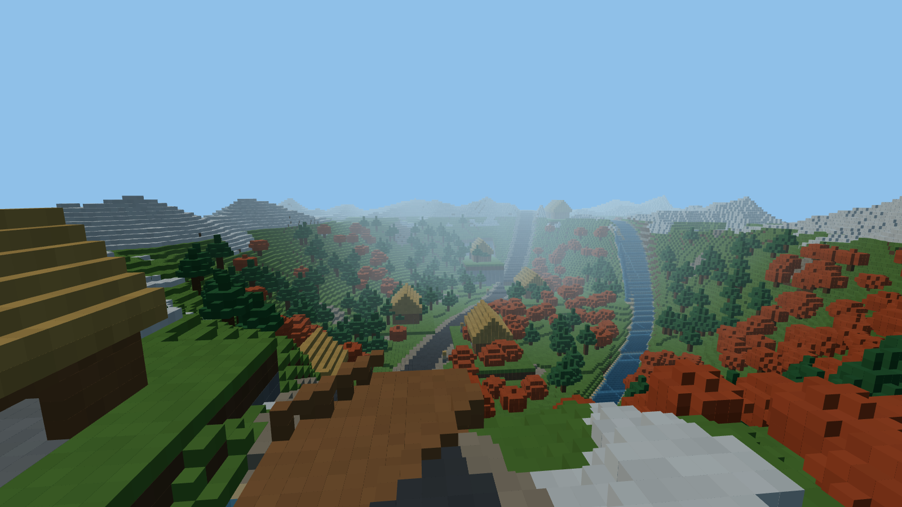
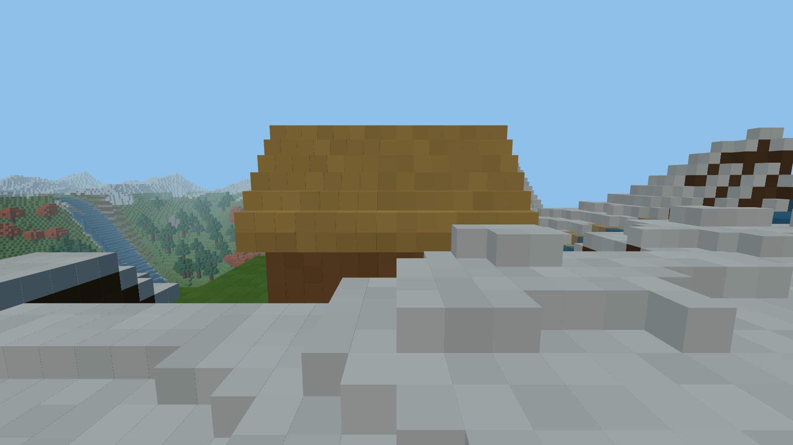
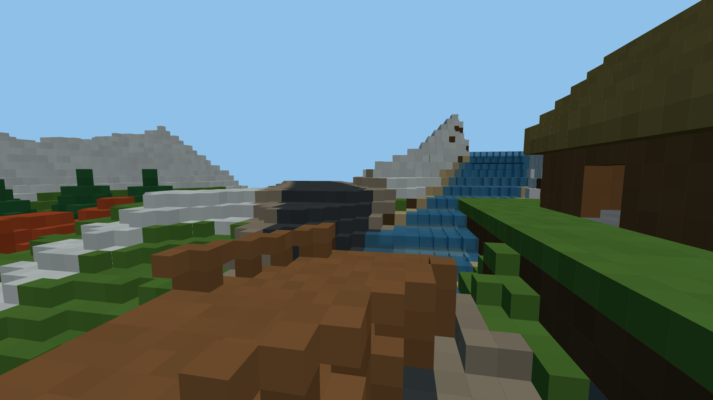
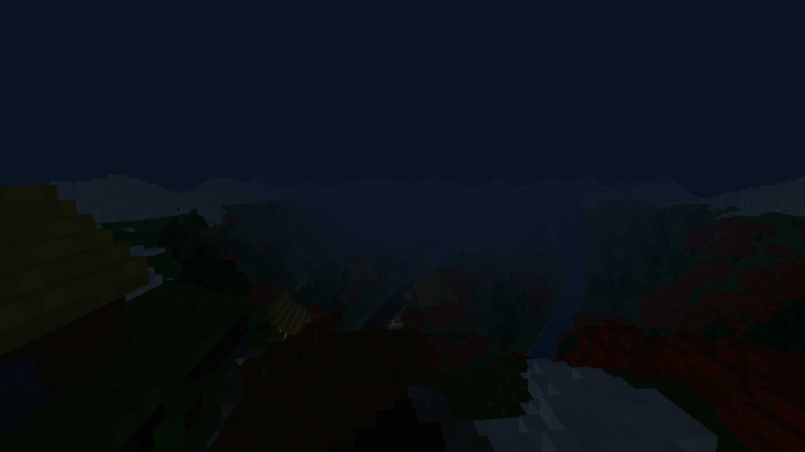

# Roads to Shirakawa-Go

[](./LICENSE)


> A 3D voxel journey along the scenic mountain road from **Takayama to Shirakawa-go** —
> procedural rural Japan rendered in your browser. Steer past gassho-zukuri farmhouses,
> autumn maple groves and stone lanterns, cross the mountain stream, and reshape the
> valley one block at a time.



---

## Highlights

- **Fully editable voxel world** — break and place blocks in real time (left / right click)
  with an 8-slot palette: rice grass, cedar wood, thatched roof, mountain stone, pine
  foliage, autumn maple, road asphalt and mountain water.
- **Procedural Takayama valley** — a meandering mountain road, a flowing stream with
  cascades, a wooden bridge, snow-capped ridgelines and a 256 × 256 × 64 voxel map.
- **Gassho-zukuri architecture** — steep thatched-roof farmhouses generated block by
  block along the road, complete with cedar walls, doors and stone foundations.
- **Living day / night cycle** — a smooth four-minute solar arc drives sun direction,
  sky and fog colour, ambient light and warm lantern glow (`N` to toggle Auto / Day / Night).
- **Procedural ambience** — Web Audio API wind, mountain stream and distant falls,
  with stream loudness that follows you as you walk the riverbank (`M` to mute).
- **Zero gameplay dependencies** — hand-rolled noise, physics, raycasting and audio.
  The only runtime dependency is [three.js](https://threejs.org/).

| Gassho farmhouse | River crossing | Nightfall |
| --- | --- | --- |
|  |  |  |

---

## Quickstart

Requirements: **Node.js ≥ 20.19** and npm.

```bash
# install dependencies
npm install

# start the Vite dev server (http://localhost:5173)
npm run dev

# production build → dist/
npm run build

# serve the production build locally
npm run preview
```

Click the canvas to capture the mouse and start exploring.

---

## Controls

| Input | Action |
| --- | --- |
| `W` `A` `S` `D` / Arrow keys | Move |
| Mouse | Look around |
| `Space` | Jump / swim up |
| `Shift` | Sprint |
| Left click | Break block |
| Right click | Place block |
| `1`–`8` / Mouse wheel | Select block from the palette |
| `N` | Cycle day / night mode (Auto → Day → Night) |
| `M` | Mute / unmute ambient audio |
| `H` | Toggle the controls panel |
| `Esc` | Release the mouse |

---

## Technology & Architecture

| Layer | Choice | Notes |
| --- | --- | --- |
| Engine | **three.js** (r186) | WebGL2 renderer, `InstancedMesh` voxel batches |
| Bundler | **Vite** | ES modules, instant HMR, `vite build` production bundle |
| Language | **JavaScript (ES2022)** | Zero build-time transpilation beyond Vite |
| Styling | **CSS3** | Glass HUD overlay, no CSS framework |
| Audio | **Web Audio API** | Procedural noise beds, filters and LFOs |
| Physics | **Custom AABB** | Axis-separated voxel collision with auto step-up |

```text
roads-to-shirakawa-go/
├── index.html              # canvas host + HUD markup
├── vite.config.js          # bundler configuration
└── src/
    ├── main.js             # entry point
    ├── config.js           # tunable gameplay constants
    ├── utils.js            # math helpers (clamp, smoothstep, hash)
    ├── core/
    │   └── Game.js         # renderer, scene, input, main loop
    ├── world/
    │   ├── blocks.js       # block registry + palette
    │   ├── noise.js        # seeded Perlin / fBm / ridged noise
    │   ├── Chunk.js        # InstancedMesh batching per chunk
    │   ├── World.js        # voxel storage + DDA raycasting
    │   └── Generator.js    # terrain, road, river, houses, trees
    ├── player/
    │   ├── Player.js       # first-person controller + physics
    │   └── BlockInteraction.js  # targeting, break / place
    ├── env/
    │   └── Sky.js          # sun arc, fog, palette, lantern lights
    ├── audio/
    │   └── AmbientAudio.js # procedural wind / stream / falls
    └── ui/
        ├── HUD.js          # hotbar, stats, toast, help
        └── hud.css         # overlay styling
```

### Voxel pipeline

The world is a flat `Uint8Array` (256 × 256 × 64) divided into 16 × 16 chunks.
Each chunk builds one opaque and one transparent `InstancedMesh` containing only
**exposed** blocks (any face adjacent to air or water), tinted per instance with a
subtle hash jitter and a cheap vertical occlusion shade. Edits mark neighbouring
chunks dirty; only dirty chunks re-mesh. Block targeting uses an Amanatides & Woo
DDA voxel traversal for exact face normals — no mesh raycasting required.

### World generation

1. fBm + ridged Perlin noise builds the valley floor and the Takayama ridgeline
   (edge-weighted so the horizon is ringed by snow-capped mountains).
2. The road is carved as a smoothed height profile along a meandering spline, with
   asphalt surface and gravel shoulders.
3. The stream is carved as a separate meander, filled with translucent water blocks;
   where it meets the road a cedar bridge with railings and pillars is generated.
4. Gassho farmhouses, pine / maple groves and roadside stone lanterns (*toro*) are
   stamped from seeded randomness away from road and river.

---

## Contributing

Contributions are welcome — please read [CONTRIBUTING.md](./CONTRIBUTING.md) for
the development workflow, code style and pull-request guidelines.

Ideas we would love help with: greedy meshing, chunk streaming, touch controls,
save / load of edited regions, seasonal palettes, and accessibility options.

---

## License

This project is licensed under the **GNU General Public License v3.0** — see
[LICENSE](./LICENSE) for the full text.

```
Roads to Shirakawa-Go — a 3D voxel journey through rural Japan
Copyright (C) 2026 aacanadaa

This program is free software: you can redistribute it and/or modify
it under the terms of the GNU General Public License as published by
the Free Software Foundation, either version 3 of the License, or
(at your option) any later version.
```

---

*Made with three.js, Vite and a fondness for mountain roads.*
